# 📖 Multilingual Story Reader Android App

This Android application enables users to read famous fairytales in multiple languages (Greek, French, and English), track reading statistics, and listen to story narrations using text-to-speech.

---

## 📱 Features

### 🧾 Story Viewer (`StoryActivity`)
- Displays detailed information about a selected story: title, author, year, content, and an image.
- Language-dependent UI: Labels and buttons adapt based on the selected language.
- Text-to-Speech (TTS) integration:
  - Supports play/stop narration in the selected language.
  - Prevents overlapping or repeated TTS playback.
  - Automatically resets narration when revisiting a story.

### 📊 Reading Statistics (`StatisticsActivity`)
- Shows a list of all available stories and how many times each has been read.
- Displays all stories regardless of selected language.
- Sorted in descending order by number of reads (favorite stories appear on top).
- All labels are dynamically localized.

---

## 🔄 Supported Languages
- 🇬🇷 Greek (`gr`)
- 🇫🇷 French (`fr`)
- 🇬🇧 English (default)

Text, labels, and TTS voices adapt based on the language selection through `AppConfig.selectedLanguage`.

---

## 🗂 Project Structure

```
📁 java/
├── activities/
│   ├── MainActivity.java
│   ├── StoryActivity.java
│   └── StatisticsActivity.java
├── adapters/
│   ├── StoryAdapter.java
│   └── StatisticsAdapter.java
├── models/
│   ├── Story.java
│   └── Statistics.java
├── utils/
│   └── AppConfig.java
└── FirebaseHelper.java
```

---

## 🛠 Technologies Used
- Java (Android SDK)
- Firebase Firestore (for tracking story reads)
- RecyclerView + Adapters
- Glide (image loading)
- Android `TextToSpeech`
- Localization (strings.xml for each supported language)

---

## 📸 UI Overview

1. **Main Screen** – List of available stories with images and metadata.
2. **Story Detail** – Full story view with narration support.
3. **Statistics** – List of stories ordered by read count.

---

## 🔊 Text-to-Speech (TTS) Details

```java
textToSpeech = new TextToSpeech(this, status -> {
    if (status == TextToSpeech.SUCCESS) {
        Locale locale = getLocaleForLanguage(AppConfig.selectedLanguage);
        int result = textToSpeech.setLanguage(locale);
        ...
    }
});
```

- Narration restarts if `Play` is tapped multiple times or the user returns to the story.
- Splits narration into 4000-character chunks (Android TTS limit).
- Dynamically adjusts locale with a helper:

```java
private Locale getLocaleForLanguage(String language) {
    switch (language.toLowerCase()) {
        case "gr": return new Locale("el", "GR");
        case "fr": return Locale.FRENCH;
        default: return Locale.ENGLISH;
    }
}
```

---

## 📈 Firebase Integration

- Every time a story is opened, its `num_read` counter is incremented via `FirebaseHelper`.
- `StatisticsActivity` fetches data from the `statistics` collection.

---

## Screenshots

### 🌐 Language Selection
- English  
  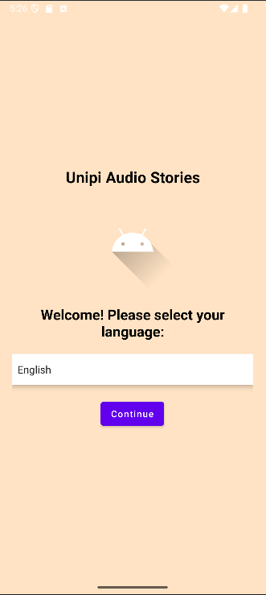
- Greek  
  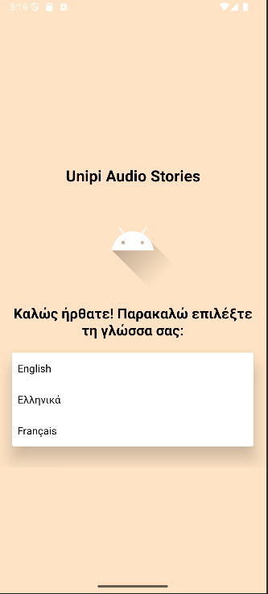

### 📋 Main Menu
- English  
  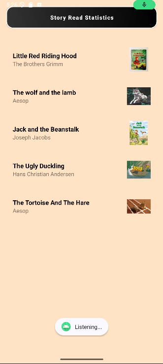
- French  
  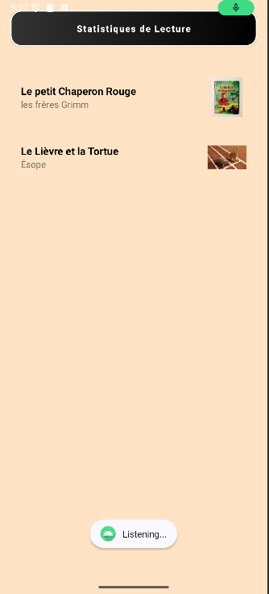

### 📖 Story Page
- English  
  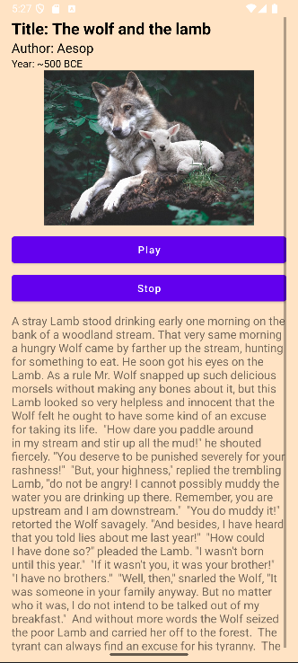

### 📊 Statistics
- English  
  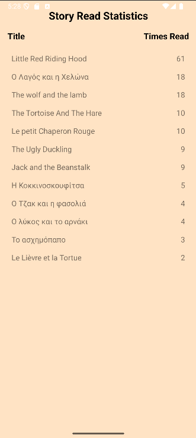
- Greek  
  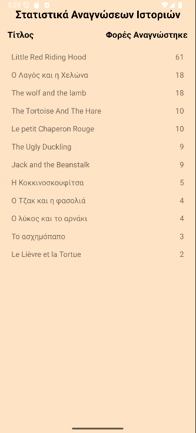

### 📱 Medium Tablet Views to ensure UI is not altered across devices
- Tablet View 1  
  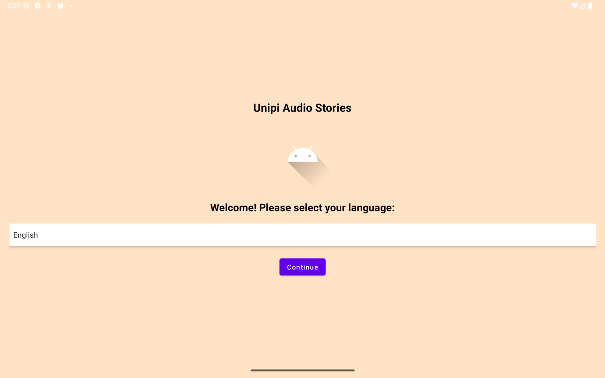
- Tablet View 2  
  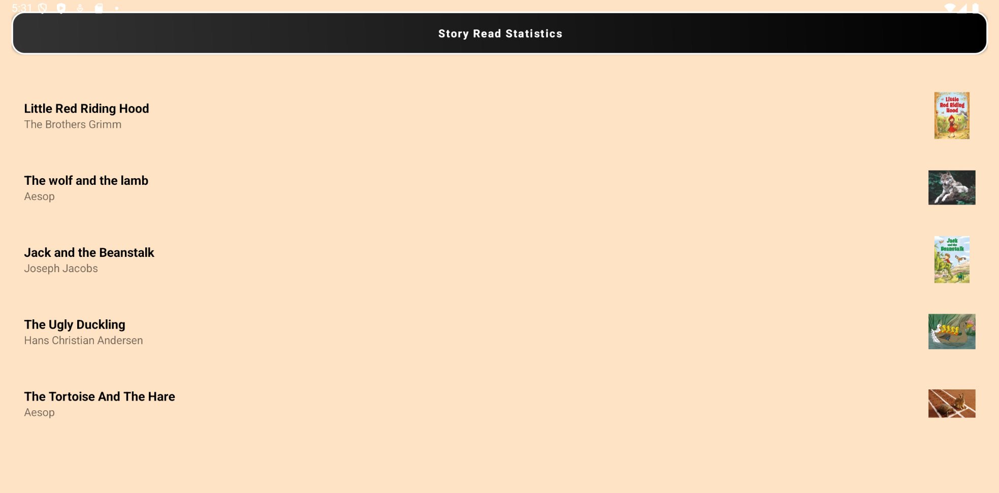
- Tablet View 3  
  
- Tablet View 4  
  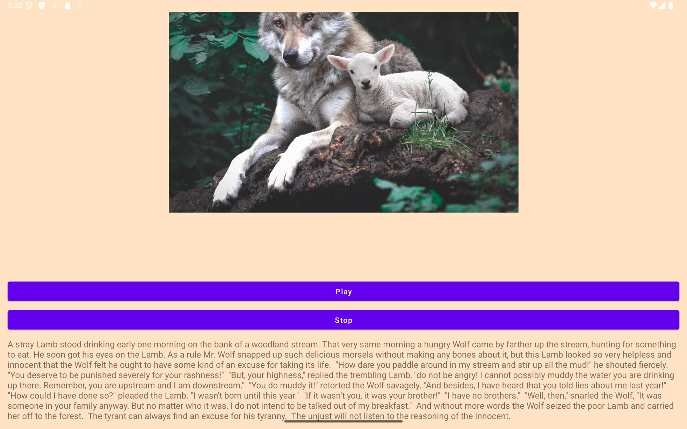
- Tablet View 5  
  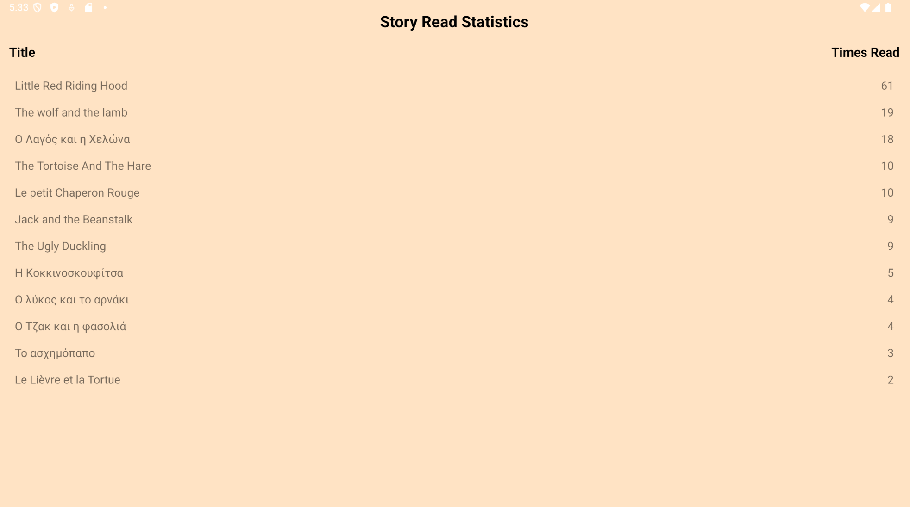

---

## 🧰 Building the Project Locally

To successfully build and run the project on your machine:

1. Install Android Studio with the latest SDK tools.

2. Clone the project:

```bash
git clone https://github.com/your-username/your-repo.git
cd your-repo
```

3. Open the project in Android Studio.

4. Manually add the following files (not tracked in Git):

### `local.properties`
```properties
sdk.dir=/path/to/your/Android/Sdk
```

### `google-services.json`
Download it from your Firebase console and place it under:
```bash
app/google-services.json
```

5. Sync Gradle and run the app on an emulator or device.
